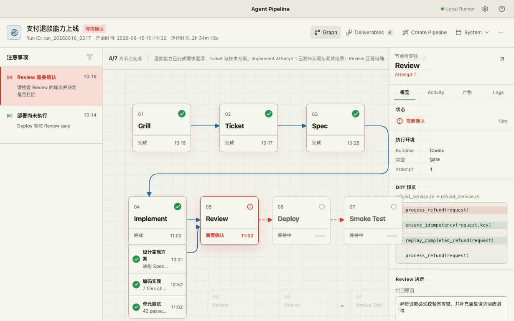

# Agent Pipeline

Agent Pipeline 把长时间 Agent 工作变成可观察、可干预、可恢复并可审计的本地桌面体验。它不重新实现 Agent 的推理和上下文管理，也不提供拖拽式流程画布；模型负责通过文本协议创建 Pipeline，App 负责 Graph、Attention、Activity、Attempt、Artifact 和恢复交互。



## 当前实现

这是 macOS Apple Silicon 的首个纵向版本，已经包含：

- Tauri 2 + Vue 3 桌面 App，Rust `PipelineCore` 与 SQLite WAL 持久化
- 首次 Onboarding 与 Doctor，实际发现本机 Pi、Codex、Claude Code、OpenCode binary 和版本
- 七阶段 Graph：Grill → Ticket → Spec → Implement ⇄ Review → Deploy → Smoke Test
- Review 打回产生新的不可变 Attempt、显式 Handoff Artifact 和追加事件
- Node Inspector 的 Overview、Activity、Artifacts、Logs
- Run Deliverables、Create Pipeline 自然语言入口与 Package Proposal
- System、Draft Light、Night Ops、Warm Paper Theme Pack
- 文本化 Package v1alpha1 的目录加载、引用约束、有界循环验证与本地不可变安装
- 与窗口解耦的本地 Runner，通过权限收紧的 Unix Socket 提供快照、指令与 Package 安装
- Pi RPC 的真实能力握手，确认 Session、模型和自动上下文压缩状态；不触发模型请求
- arm64 `.app` / DMG 构建与已安装 App 的端到端 UI 验收

当前工作节点仍由确定性示例 Adapter 驱动，用来验证编排、恢复和 UI；Pi 已接入只读 RPC 握手，但尚未执行真实 Prompt。Codex App Server/ACP、Claude/OpenCode Adapter、Git Package 获取与真实部署仍是后续里程碑。不要把当前版本用于生产部署。

## Privacy

Host App 没有云端、遥测或崩溃上报。Run 状态和事件保存在 macOS App Data 的 SQLite 中。Agent CLI 保有自己的认证；Doctor 只读取 binary 路径和版本，不读取认证文件，也不发送模型请求。外部 Agent、MCP 和业务系统是否联网由用户的本地配置与 Node Policy 决定。

## Development

要求 Node 24 LTS、pnpm 10、Rust 1.93、macOS 14+ 与 Apple Silicon。

```bash
pnpm install
pnpm test
pnpm tauri:dev
pnpm tauri:build
```

构建产物：

- `target/aarch64-apple-darwin/release/bundle/macos/Agent Pipeline.app`
- `target/aarch64-apple-darwin/release/bundle/dmg/Agent Pipeline_<version>_aarch64.dmg`

## Repositories

- Host App：`cleanwk/agent-pipeline`
- 七阶段示例 Package：`cleanwk/agent-pipeline-example`
- Homebrew Tap：`cleanwk/homebrew-tap`

公开 Release 完成 Developer ID 签名与 notarization 后，安装命令将是：

```bash
brew install --cask cleanwk/tap/agent-pipeline
```

安装后的 App 会在启动时检查 GitHub Release 中经过签名的更新；也可从右上角“更多 → 检查版本更新”手动检查，并在 App 内完成下载、验证、安装和重启。发布仓库配置 `TAURI_SIGNING_PRIVATE_KEY`、`TAURI_SIGNING_PRIVATE_KEY_PASSWORD` 和对应的 `TAURI_UPDATER_PUBLIC_KEY` 后，Release workflow 会生成供客户端读取的 `latest.json` 与签名更新包；未配置时仍会发布 DMG，但会跳过 updater artifacts。源码开发配置中的 `__TAURI_UPDATER_PUBLIC_KEY__` 只作为占位符，正式签名构建会由 workflow 替换，私钥不得提交到仓库。

## 发布新版本

运行 `pnpm release:version <版本号>`（例如 `pnpm release:version 0.2.0`），检查生成的版本改动后提交并推送到 `main`。脚本会同步根项目、桌面端、Tauri 和 Rust workspace 的版本；`VERSION` 的变更会自动触发 GitHub Actions，在 macOS runner 上构建 Apple Silicon DMG，然后创建 `v<版本号>` GitHub Release；配置 Apple signing secrets 后，构建还会完成 Developer ID 签名与公证。用户可以直接从该 Release 下载 DMG 安装。

如需 Developer ID 签名与公证，仓库应配置 `APPLE_CERTIFICATE`、`APPLE_CERTIFICATE_PASSWORD`、`APPLE_SIGNING_IDENTITY`、`APPLE_ID`、`APPLE_PASSWORD`、`APPLE_TEAM_ID`。Apple 与 Tauri updater 两组 secrets 都是可选配置，但每组一旦启用就必须完整配置；均未配置时工作流会发布未签名 DMG。工作流会拒绝覆盖已经存在的版本 Tag，失败后应发布一个新版本号。

## Design and architecture

- [Product contract](PRODUCT.md)
- [Shipped design system](DESIGN.md)
- [Domain context](CONTEXT.md)
- [Architecture decisions](docs/adr/)
- [Ecosystem research](docs/research/extensible-agent-pipeline-design.md)

License: Apache-2.0.
